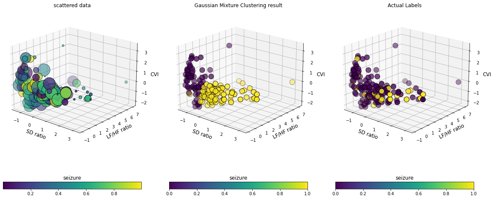

# HRV-Based Seizure Clustering Using Gaussian Mixture Models

This project explores the use of unsupervised learning to cluster heart rate variability (HRV) features into seizure-related and non-seizure patterns using a Gaussian Mixture Model (GMM).

## Methodology

- Selected three HRV features for clustering: SD ratio, LF/HF ratio, and CVI
- Standardized features using z-score normalization
- Applied a Gaussian Mixture Model (GMM) for unsupervised clustering
- Compared clustering results against expert-provided seizure annotations
- Evaluated performance using both clustering and label agreement metrics

## Clustering Results

  

*3D visualization of HRV feature space showing raw data distribution, GMM clustering results, and expert-labeled seizure annotations.*

